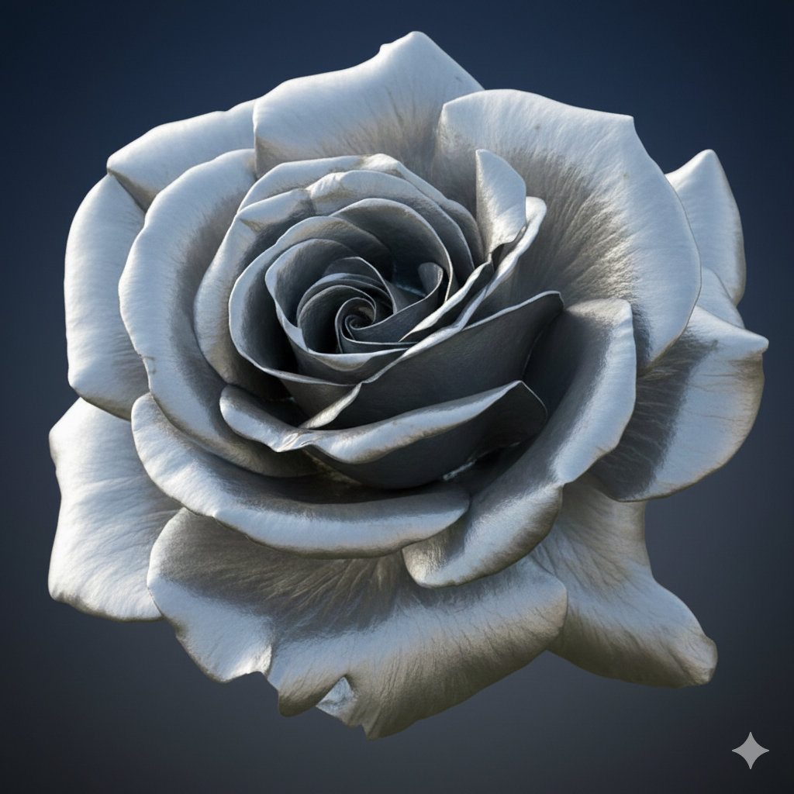
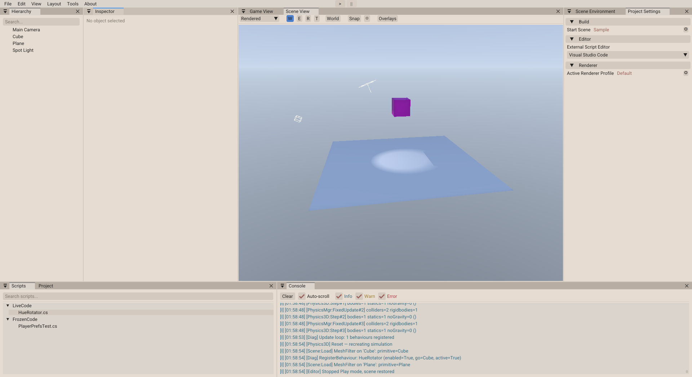

<p align="center">
  
</p>

<h1 align="center">IronRose Engine</h1>

<p align="center">
  <b>Unity 스타일 API를 갖춘 크로스 플랫폼 C# 게임 엔진</b><br/>
  Vulkan 기반 Deferred/Forward 하이브리드 렌더링 · Roslyn 핫 리로드 · ImGui 에디터
</p>

<p align="center">
  
  
  
  
</p>

---

## 📸 스크린샷

<p align="center">
  
</p>

---

## ✨ 주요 기능

| 분류 | 기능 |
|------|------|
| **렌더링** | Deferred + Forward 하이브리드 파이프라인, PBR 라이팅, IBL/Skybox |
| **포스트 프로세싱** | Bloom, ACES Tone Mapping, Gaussian Blur, SSIL, FSR 업스케일링 |
| **조명** | Directional / Point / Spot Light, Shadow Mapping (Atlas + Point Shadow) |
| **물리** | BepuPhysics v2.4 (3D) + Aether.Physics2D v2.2 (2D) |
| **에디터** | ImGui 기반 Scene View, Inspector, Hierarchy, Object Picking, Gizmo |
| **스크립팅** | Roslyn 런타임 컴파일 & 핫 리로드 (LiveCode) |
| **에셋 파이프라인** | glTF/glb, OBJ, FBX 임포트 · BC5/BC7 텍스처 압축 · 자체 메타데이터 시스템 |
| **Unity 호환 API** | GameObject, MonoBehaviour, Transform, Input, Physics 등 ~60개 클래스 |

---

## 🏗️ 아키텍처

```
IronRose.sln
├── src/
│   ├── IronRose.Engine        # 엔진 코어 (ECS, 씬, 에셋, 입력, Unity 호환 API)
│   ├── IronRose.Rendering     # 렌더링 파이프라인 (G-Buffer, PostProcess, Shader 컴파일)
│   ├── IronRose.Physics       # 물리 엔진 래퍼 (BepuPhysics + Aether.Physics2D)
│   ├── IronRose.Scripting     # Roslyn 런타임 컴파일 및 핫 리로드
│   ├── IronRose.Contracts     # 플러그인 API 계약 (인터페이스)
│   ├── IronRose.Editor        # 에디터 UI 컴포넌트 (ImGui)
│   ├── IronRose.AssetPipeline # 에셋 임포트/변환 파이프라인
│   ├── IronRose.RoseEditor    # 에디터 실행 프로젝트 (진입점)
│   └── IronRose.Standalone    # Standalone 빌드 실행 프로젝트
├── LiveCode/                  # 핫 리로드 대상 실험 스크립트
├── FrozenCode/                # 안정화된 게임 스크립트
├── Shaders/                   # GLSL 셰이더 (48개)
├── Assets/                    # 게임 에셋 (텍스처, 모델, 씬, 프리팹 등)
└── external/                  # 외부 라이브러리 (FSR 3.1)
```

### 핵심 의존성

| 패키지 | 용도 |
|--------|------|
| [Veldrid](https://github.com/veldrid/veldrid) 4.9 | 크로스 플랫폼 그래픽스 추상화 (Vulkan/Metal/D3D11) |
| [Silk.NET](https://github.com/dotnet/Silk.NET) 2.23 | 윈도우/입력 관리 |
| [ImGui.NET](https://github.com/ImGuiNET/ImGui.NET) 1.91 | 에디터 UI |
| [BepuPhysics](https://github.com/bepu/bepuphysics2) | 3D 물리 시뮬레이션 |
| [Aether.Physics2D](https://github.com/nkast/Aether.Physics2D) | 2D 물리 시뮬레이션 |
| [SharpGLTF](https://github.com/vpenades/SharpGLTF) | glTF/glb 모델 임포트 |
| [AssimpNet](https://github.com/assimp/assimp-net) | 범용 3D 모델 임포트 |
| [SixLabors.ImageSharp](https://github.com/SixLabors/ImageSharp) | 이미지 로딩/처리, 폰트 렌더링 |

---

## 🏛️ 엔진 철학

IronRose는 Unity와 달리, **항상 소스코드와 함께 사용되고 소스코드와 함께 실행**됩니다. 빌드된 바이너리 배포나 Hub 설치 개념이 없습니다. 개발자는 항상 엔진 소스 레포(`IronRose`)를 로컬에 두고 `ProjectReference`로 직접 참조합니다.

### 2-레포 구조 (예정)

현재는 단일 레포 구조이나, Unity Hub처럼 **엔진 레포**와 **에셋 프로젝트 레포**를 분리하는 것을 목표로 합니다:

```
~/git/
  IronRose/          # 엔진 레포 (소스 코드 + 기본 셰이더)
  MyGame/            # 에셋 프로젝트 레포 (LiveCode, FrozenCode, Assets 등)
```

에셋 프로젝트는 `ProjectReference Path="../IronRose/..."` 로 엔진을 직접 참조합니다. Hub UI 없이 에디터에서 프로젝트 폴더를 열어 사용합니다. 설계 상세는 [`plans/editor-assets-repo-separation.md`](plans/editor-assets-repo-separation.md)를 참조하세요.

---

## 🚀 시작하기

### 요구 사항

- **.NET 10.0 SDK**
- **Vulkan 지원 GPU** (드라이버 설치 필요)

### 빌드 및 실행

```bash
# 저장소 클론
git clone https://github.com/alienspy2/IronRose.git
cd IronRose

# Vulkan SDK 설치 (Linux)
./install_vulkan.sh

# 빌드
dotnet build

# 에디터 실행
dotnet run --project src/IronRose.RoseEditor

# Standalone (게임 런타임) 실행
dotnet run --project src/IronRose.Standalone
```

---

## 🔧 스크립팅 워크플로우

IronRose는 **LiveCode / FrozenCode** 이중 스크립트 구조를 사용합니다.

```
LiveCode/   → 실험 중인 스크립트 (Roslyn 런타임 핫 리로드)
FrozenCode/ → 안정화된 스크립트 (컴파일 타임 참조)
```

1. `LiveCode/`에 새 C# 스크립트 작성
2. 엔진 실행 중 파일 저장 → **자동 핫 리로드**
3. 테스트 완료 후 `FrozenCode/`로 편입

> **참고**: Unity와 유사한 API(`GameObject`, `MonoBehaviour`, `Transform` 등)를 제공하므로, Unity 경험이 있다면 친숙하게 사용할 수 있습니다.

---

## 🎨 셰이더

GLSL 기반 셰이더 48개를 포함합니다:

- **Deferred Rendering**: Geometry Pass, Ambient/Directional/Point/Spot Lighting Pass
- **Shadow**: Directional Shadow Atlas, Point Shadow (Cubemap), Blur
- **Post Processing**: Bloom (Threshold + Composite), Gaussian Blur, ACES Tonemapping
- **Screen Space**: SSIL (Main + Temporal + Denoise + Depth Prefilter)
- **Upscaling**: FSR CAS + Spatial Upscale (Compute Shader)
- **Editor**: SceneView Diffuse/MatCap, Object Picking, Outline, Gizmo, Material Preview

---

## 📁 프로젝트 설정

| 파일 | 설명 |
|------|------|
| `project.toml` | 프로젝트 루트 설정 (엔진 경로, 빌드 설정) — 에셋 프로젝트 레포 분리 시 도입 예정 |
| `rose_config.toml` | 엔진 설정 (캐시, 텍스처 압축) |
| `rose_projectSettings.toml` | 프로젝트별 설정 |
| `.rose_editor_state.toml` | 에디터 레이아웃/상태 저장 |
| `Directory.Build.props` | MSBuild 전역 빌드 속성 |

> 모든 설정 파일은 **TOML** 포맷을 사용합니다.

---

## 📄 라이선스

[MIT License](LICENSE) © 2026 alienspy2
